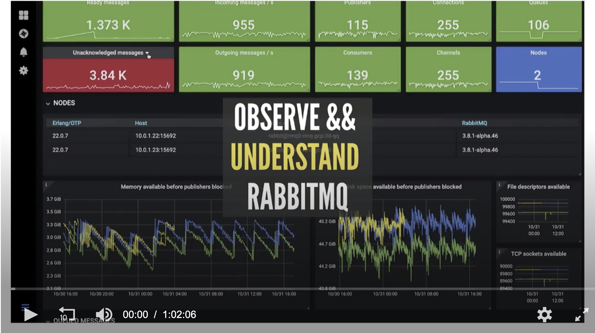

# [TGIR S01E00: Understand RabbitMQ - The New Metrics System](https://content.pivotal.io/webinars/dec-12-understand-rabbitmq-for-developers-and-operators-webinar?utm_campaign=rabbitmq-devops-erlang_q419&utm_source=github&utm_medium=social)

<a href="https://content.pivotal.io/webinars/dec-12-understand-rabbitmq-for-developers-and-operators-webinar?utm_campaign=rabbitmq-devops-erlang_q419&utm_source=github&utm_medium=social" target="_blank"></a>

* Hosted by [@gerhardlazu](https://twitter.com/gerhardlazu) & [@DormainDrewitz](https://twitter.com/DormainDrewitz)
* Recorded on: 2019-12-12

## Introduction

Hi everybody, I am [Gerhard Lazu](https://gerhard.io), [a RabbitMQ Engineer](https://github.com/rabbitmq/rabbitmq-server/pulls?utf8=%E2%9C%93&q=author%3Agerhard) based in London.

In the next hour, we will see what happens within RabbitMQ by using the new metrics system that we have shipped in RabbitMQ 3.8.
We are currently on RabbitMQ 3.8.2, meaning that the 3.8 series was out for about 2 months now, since early October.
Yes, that's right, we usually ship 1 patch release per month, across all supported RabbitMQ minors, currently 3.7 & 3.8.

The new metrics system in 3.8 is an evolution of what many of you know & use in today's RabbitMQ Management

In this webinar, I want you to see RabbitMQ in a different light,
[even when it is struggling](rabbitmq-management-unresponsive-43.gif),
and understand why that is, as well as give you a few tips about what to do.

Because this webinar is a series of demos, please ask questions as they come up.
I will stop at regular intervals and answer as many of your questions as possible.

OK, so we will start by setting up the new metrics system in RabbitMQ 3.8 from scratch.
This includes integrating with Prometheus & Grafana.
Even though this is something that you may not need to do if you are using RabbitMQ as a service,
for example [RabbitMQ for Kubernetes](https://content.pivotal.io/blog/introducing-rabbitmq-for-kubernetes), and I belive [RabbitMQ for PCF](https://docs.pivotal.io/rabbitmq-cf) as well,
it's important to understand how the various pieces fit together.

After we have covered the basics,
we will continue by learning about the new Grafana dashboards that our team maintains:
* where to find them
* how to install them
* and how to use them

As we do this, I want you to remember that the end-goal is to understand RabbitMQ.

To finish off, we will see how to share the state of RabbitMQ deployments when asking for help.
In order for our team to help you, and improve RabbitMQ, we need to understand what is going on.
My hope is that going forward, we will have more than screenshots and logs to go by.

## How do we get started with the new metrics in RabbitMQ 3.8?

I will be using Docker for Desktop in my demo to keep us focused on the task at hand.

I don't think that I need to mention this, but just to be explicit, I do not recommend that you do this in production.

Ok, with that out of the way, let's start a single node RabbitMQ with Management enabled:

```sh
# make rabbitmq
/usr/local/bin/docker run -it --rm \
  --name getstarted0 \
  --hostname getstarted0 \
  --network 1212 \
  -p 15672:15672 \
  -p 15692:15692 \
  rabbitmq:3.8.2-management
```

Is RabbitMQ up and running as expected? http://localhost:15672

Before we continue, we want to put some load on this RabbitMQ node so that there are more metrics to look at when we get to that point.

As some of you may now, PerfTest has been the official RabbitMQ benchmarking tool for many years now.

To start a PerfTest instance:

```
# make perftest
```

### 1/3. Enable the `rabbitmq_prometheus` plugin

```sh
# make rabbitmq_enable_prometheus
docker exec -it getstarted0 rabbitmq-plugins enable rabbitmq_prometheus
```

What do the new Prometheus metrics look like? http://localhost:15692/metrics

Notice the new port, which is different from the Management one.

Learn more about this new plugin in RabbitMQ 3.8: https://github.com/rabbitmq/rabbitmq-prometheus

### 2/3. Configure Prometheus to pull RabbitMQ metrics periodically

We first need a Prometheus:

```sh
# make prometheus
docker run -it --rm \
  --name prometheus \
  --hostname prometheus \
  --network 1212 \
  -p 9090:9090 \
  prom/prometheus:v2.14.0
```

By default, what targets is Prometheus configured to scrape? http://localhost:9090/targets

Let's configure Prometheus to scrape RabbitMQ:

```sh
# make prometheus_exec
docker exec -it prometheus sh

vi /etc/prometheus/prometheus.yml

#  - job_name: 'rabbitmq'
#    static_configs:
#    - targets: ['getstarted0:15692']

pkill -HUP prometheus
```

Was the Prometheus configuration applied correctly? http://localhost:9090/config

Is the new RabbitMQ target being scraped correctly? http://localhost:9090/targets

Can we see some RabbitMQ metrics in Prometheus? http://localhost:9090/new/graph

* `rabbitmq_identity_info`
* `rabbitmq_build_info`

### 3/3. Configure Grafana to visualise RabbitMQ metrics from Prometheus

We first need a Grafana:

```sh
# make grafana
/usr/local/bin/docker run -it --rm \
  --name grafana \
  --hostname grafana \
  --network 1212 \
  -p 3000:3000 \
  grafana/grafana:6.4.5
```

Secondly, we need to configure Prometheus datasource in Grafana: http://localhost:3000

Lastly, let's import a Grafana dashboard: http://localhost:3000/dashboards + https://grafana.com/orgs/rabbitmq

Now that we understand the mechanics of how the different pieces fit together,
let us shift focus on what this dashboard is actually trying to show us,
and that we are not seeing here.

## Operators: see RabbitMQ anti-patterns & imbalances

* [RabbitMQ Overview - Reasoning about the metrics shown](https://www.rabbitmq.com/prometheus.html#graphs)

## Developers: understand Quorum Queues

* [RabbitMQ Quorum Queues - Raft](https://grafana.com/grafana/dashboards/11340)

## Experts: unlock Erlang insights

* [Erlang Memory Allocators](https://grafana.com/grafana/dashboards/11350)
* [Erlang Distribution](https://grafana.com/grafana/dashboards/11352)

## All: share your context

[How to share a snapshot](https://gerhard.io/slides/observe-understand-rabbitmq/#/20) - ran out of time.
