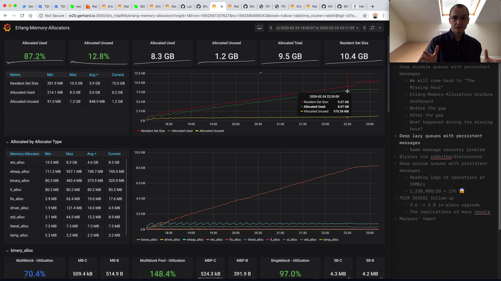
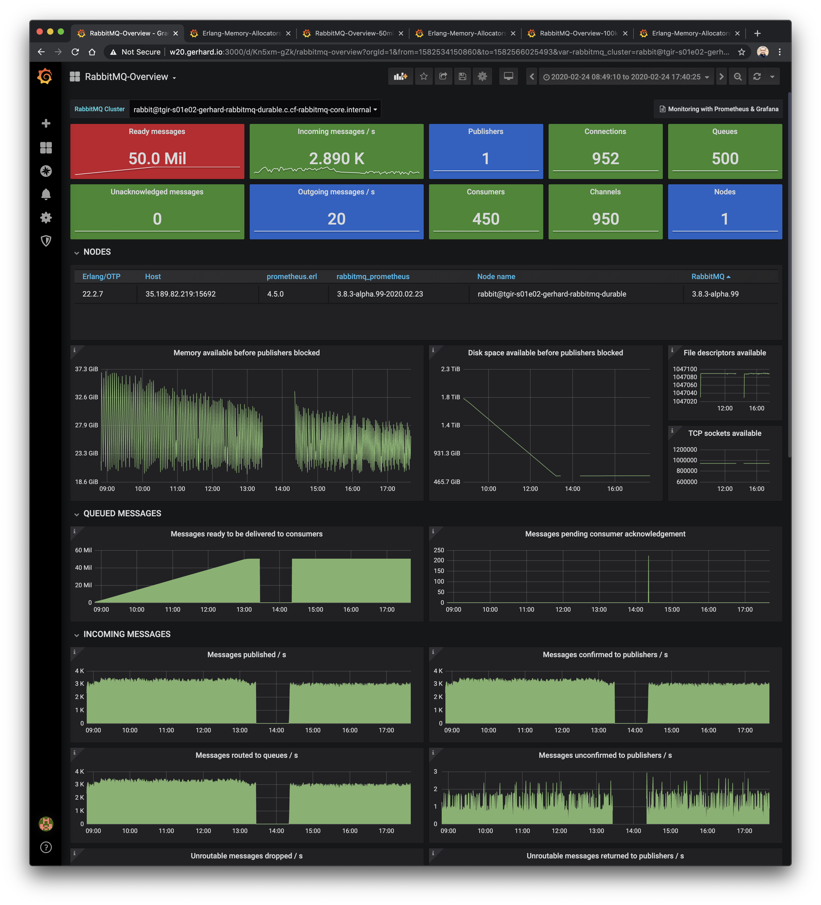
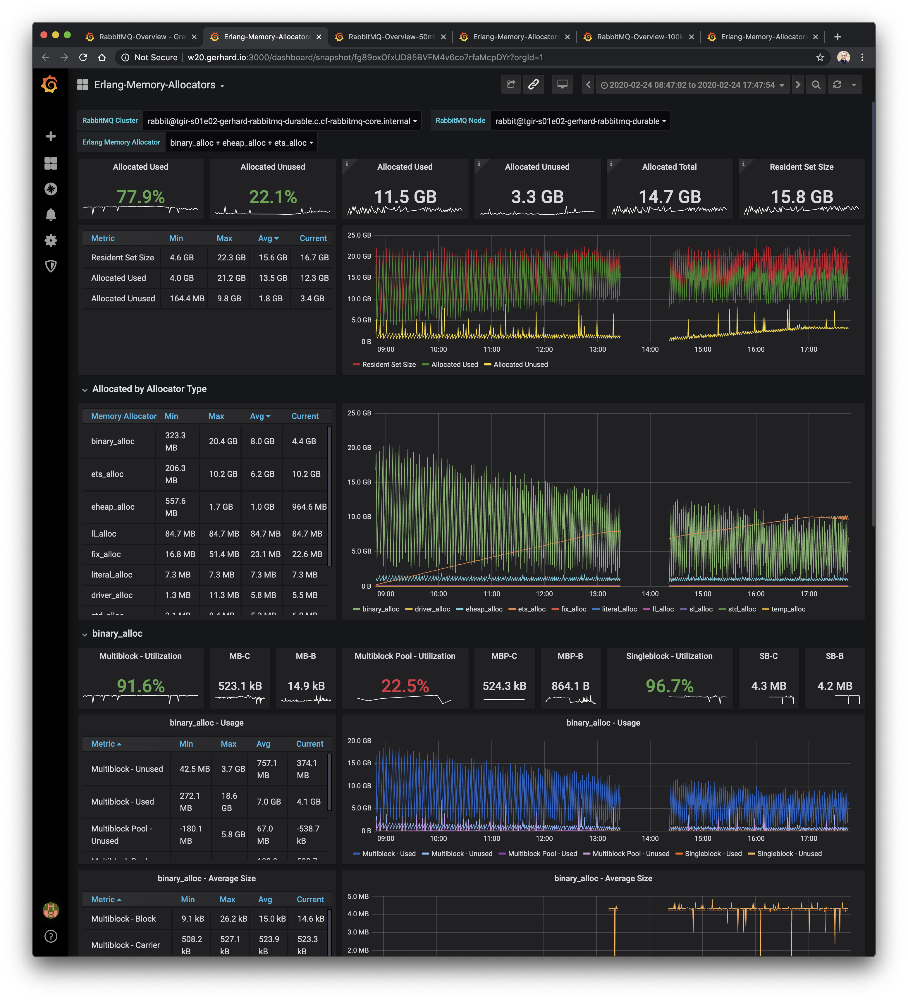

# TGIR S01E02: Help! RabbitMQ ate my RAM!

* Proposed by [@Farkie](https://github.com/Farkie) via [rabbitmq/tgir#5](https://github.com/rabbitmq/tgir/issues/5) & [@lyrixx](https://github.com/lyrixx) via [rabbitmq/discussions#59](https://github.com/rabbitmq/discussions/issues/59)
* Hosted by [@gerhardlazu](https://twitter.com/gerhardlazu)
* Published on: 2020-02-28
* Video: https://www.youtube.com/watch?v=dkAhsp-Oxf4

<a href="https://www.youtube.com/watch?v=dkAhsp-Oxf4" target="_blank"></a>

In this episode we will try to understand what happens under the Erlang hood when RabbitMQ is using a lot of memory and what we can do about it.
We will be covering the interactions between RabbitMQ, Erlang Memory Allocators and the Linux Resident Set Size memory.

There is an unexpected twist - a.k.a. The One Hour Gap - as well as 2 short follow-ups to last month's episode.

As always, you can follow along - all commands are available as make targets in this episode's directory.


## Timeline

- [00:00:00](https://www.youtube.com/watch?v=dkAhsp-Oxf4&t=0s) - Today's topic
- [00:02:29](https://www.youtube.com/watch?v=dkAhsp-Oxf4&t=149s) - RabbitMQ-Overview for 50 mil persistent messages in durable queues
- [00:05:38](https://www.youtube.com/watch?v=dkAhsp-Oxf4&t=338s) - Erlang-Memory-Allocators Grafana dashboard
- [00:06:50](https://www.youtube.com/watch?v=dkAhsp-Oxf4&t=410s) - Resident Set Size (RSS) vs Erlang Allocated Used & Unused
- [00:10:00](https://www.youtube.com/watch?v=dkAhsp-Oxf4&t=600s) - The most important Erlang memory allocators: binary, ETS & eheap
- [00:14:00](https://www.youtube.com/watch?v=dkAhsp-Oxf4&t=840s) - Multiblock vs Singleblock Carriers
- [00:16:26](https://www.youtube.com/watch?v=dkAhsp-Oxf4&t=986s) - Why does Allocated Unused memory keep growing?
- [00:19:11](https://www.youtube.com/watch?v=dkAhsp-Oxf4&t=1151s) - Memory & disk considerations for recovering large backlogs of persistent messages
- [00:25:55](https://www.youtube.com/watch?v=dkAhsp-Oxf4&t=1555s) - Memory profile for 50 mil persistent messages in lazy queues
- [00:30:07](https://www.youtube.com/watch?v=dkAhsp-Oxf4&t=1807s) - Recommendations for @Farkie - rabbitmq/tgir#5
- [00:31:54](https://www.youtube.com/watch?v=dkAhsp-Oxf4&t=1914s) - Recommendations for @lyrixx - rabbitmq/discussions#59
- [00:34:34](https://www.youtube.com/watch?v=dkAhsp-Oxf4&t=2074s) - TGIR S01E01 follow-up: RabbitMQ 3.6 to 3.8 in-place upgrade
- [00:36:16](https://www.youtube.com/watch?v=dkAhsp-Oxf4&t=2176s) - TGIR S01E01 follow-up: RabbitMQ node startup with many vhosts
- [00:37:53](https://www.youtube.com/watch?v=dkAhsp-Oxf4&t=2273s) - [Marques Johansson is paying attention](https://twitter.com/gerhardlazu/status/1223289151086350338)! TGIR is also inspired by [TBS](https://www.youtube.com/channel/UC19FgzMBMqBro361HbE46Fw), not just [TGIK](https://www.youtube.com/playlist?list=PL7bmigfV0EqQzxcNpmcdTJ9eFRPBe-iZa) 🙌


## Links

- [Linux ate my ram!](https://www.linuxatemyram.com/)
- [RabbitMQ - Monitoring with Prometheus & Grafana](https://www.rabbitmq.com/prometheus.html)
  - [The New Metrics System in RabbitMQ 3.8](https://github.com/rabbitmq/tgir/tree/S01E02/s01/e00)
- [RabbitMQ-Overview for 50 mil persistent messages in durable queues](http://w20.gerhard.io:3000/dashboard/snapshot/OXM7DEODM4pWz4rUNTwB5gXof9ejlHBo) (expires in April 2020)
  - [Erlang-Memory-Allocators Grafana dashboard](https://grafana.com/grafana/dashboards/11350)
  - [Erlang-Memory-Allocators for 50 mil persistent messages in durable queues](http://w20.gerhard.io:3000/dashboard/snapshot/fg89oxOfxUD85BVFM4v6co7rfaMcpDYr) (expires in April 2020)
- [Should a node with 50mil persistent messages of size 26KB require 80GB of RAM during startup?](https://github.com/rabbitmq/rabbitmq-server/issues/2254)
- [RabbitMQ-Overview for 50 mil persistent messages in lazy queues](http://w20.gerhard.io:3000/dashboard/snapshot/KQcMkRoMgy7h9JevMSbSfwFMBkueQDAc) (expires in April 2020)
  - [Erlang-Memory-Allocators for 50 mil persistent messages in lazy queues](http://w20.gerhard.io:3000/dashboard/snapshot/rFwhDiv5mCBAAS6sh5na8ZdOtFw2b420) (expires in April 2020)
- [RabbitMQ-Overview for 100k persistent messages in lazy queues](http://w20.gerhard.io:3000/dashboard/snapshot/PlVavo1iLeC9oYYFb0ZSgY54SQhm0I3m) (expires in April 2020)
  - [Erlang-Memory-Allocators for 100k persistent messages in lazy queues](http://w20.gerhard.io:3000/dashboard/snapshot/ZT5DWpjyGlbdsGHWLeo3bVaXiXE8RJHP) (expires in April 2020)
- [Erlang - The Memory Subsystem: Stacks, Heaps and Garbage Collection](https://github.com/happi/theBeamBook/blob/master/chapters/memory.asciidoc)
- [Erlang - erts_alloc](http://erlang.org/doc/man/erts_alloc.html)
- [TGIR S01E01 follow-up: RabbitMQ 3.6 to 3.8 in-place upgrade](https://groups.google.com/d/msg/rabbitmq-users/DnFmA54_LJk/NjjCZ2Q3AwAJ)
- [TGIR S01E01 follow-up: RabbitMQ node startup with many vhosts](https://groups.google.com/d/msg/rabbitmq-users/DnFmA54_LJk/zdewyb_HAwAJ)
- [@displague](https://github.com/displague) is paying attention: [TGIR is a combination of TGIK & TBS](https://twitter.com/gerhardlazu/status/1223289151086350338)


## Screenshots




Find more screenshots in the directory.


## Make targets

```
backlog-%                   Simulate message backlog
bash-%                      Open a shell session on instance
ctop-%                      Open ctop session
delete-%                    Delete instance
deps                        Resolve all dependencies
htop-%                      Open htop session
instances                   List all instances
management-%                Open RabbitMQ Management
netdata-%                   Start netdata & open dashboard
prometheus-%                Open RabbitMQ Prometheus
rabbitmq-%                  Create RabbitMQ server
ssh-%                       Open SSH session
workload-%                  Simulate workload
```

To reproduce the first setup you will need a GCP account & Google Cloud SDK, then just run:

```
make deps
make rabbitmq-durable backlog-durable workload-durable
make netdata-rabbitmq-durable
make management-rabbitmq-durable
make ctop-rabbitmq-durable
```

Replace `durable` with `lazy` in the above commands to reproduce the second setup.

To delete all instances, run:

```
make delete-rabbitmq-durable delete-backlog-durable delete-workload-durable
make delete-rabbitmq-lazy delete-workload-lazy
```
