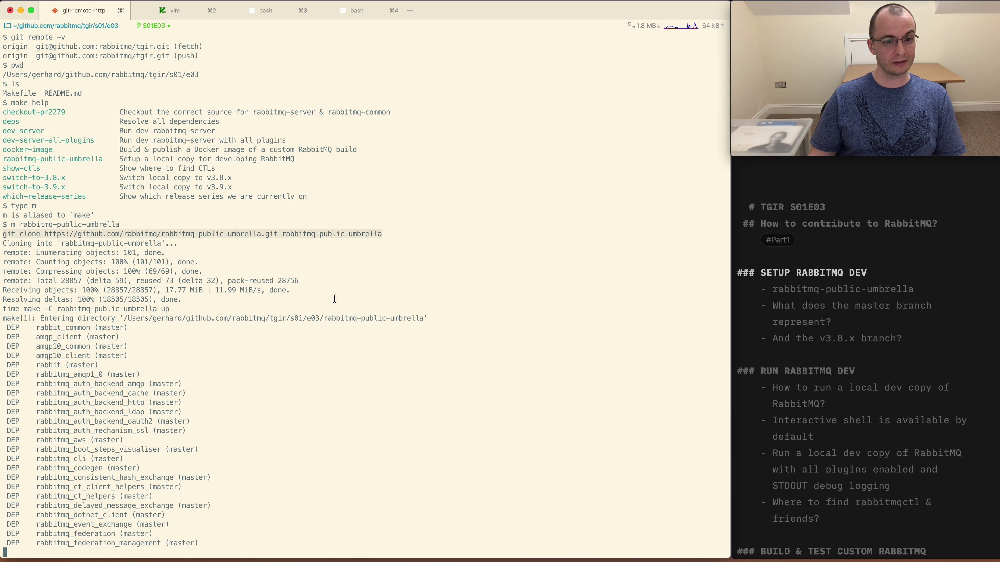

# TGIR S01E03: How to contribute to RabbitMQ? Part 1

* Proposed via [rabbitmq/tgir#4](https://github.com/rabbitmq/tgir/issues/4)
* Hosted by [@gerhardlazu](https://twitter.com/gerhardlazu)
* Published on: 2020-03-27
* Video: https://www.youtube.com/watch?v=EWU7WCqD_YA

<a href="https://www.youtube.com/watch?v=EWU7WCqD_YA" target="_blank"></a>

This is the first part of a multi-part series on how to contribute to RabbitMQ.
Our contribution will be to verify that a fix is ready to ship in the next RabbitMQ v3.8.4 patch release.

We will start by getting a local development copy of RabbitMQ up and running.
Next, we will learn about different ways of running RabbitMQ, and how to use the local CLIs.
To wrap-up, we will build a Docker image and verify that the fix is ready to ship in the next public release.

To get the best out of this episode, I encourage you to follow along.
All commands are available as make targets in this episode's directory.


## Timeline

- [00:00:00](https://www.youtube.com/watch?v=EWU7WCqD_YA&t=0s) - Today's topic
- [00:01:56](https://www.youtube.com/watch?v=EWU7WCqD_YA&t=116s) - What's with the episode README & Makefile?
- [00:04:53](https://www.youtube.com/watch?v=EWU7WCqD_YA&t=293s) - How to setup for local RabbitMQ development?
- [00:06:57](https://www.youtube.com/watch?v=EWU7WCqD_YA&t=417s) - What do the master and v3.8.x branch represent?
- [00:11:05](https://www.youtube.com/watch?v=EWU7WCqD_YA&t=665s) - How to run RabbitMQ in local development mode?
- [00:11:43](https://www.youtube.com/watch?v=EWU7WCqD_YA&t=703s) - What installs Erlang & Elixir?
- [00:14:31](https://www.youtube.com/watch?v=EWU7WCqD_YA&t=871s) - Interactive shell on the local RabbitMQ node
- [00:19:01](https://www.youtube.com/watch?v=EWU7WCqD_YA&t=1141s) - Run a local dev copy of RabbitMQ with all plugins enabled and STDOUT debug logging
- [00:24:35](https://www.youtube.com/watch?v=EWU7WCqD_YA&t=1475s) - Where to find rabbitmqctl & friends?
- [00:27:17](https://www.youtube.com/watch?v=EWU7WCqD_YA&t=1638s) - Man pages for rabbitmqctl & friends
- [00:29:02](https://www.youtube.com/watch?v=EWU7WCqD_YA&t=1742s) - The issue we reported in S01E02
- [00:30:53](https://www.youtube.com/watch?v=EWU7WCqD_YA&t=1853s) - Build a Docker image of rabbitmq-server#2279 & rabbitmq-common#368
- [00:35:48](https://www.youtube.com/watch?v=EWU7WCqD_YA&t=2148s) - Run custom RabbitMQ Docker image locally
- [00:39:00](https://www.youtube.com/watch?v=EWU7WCqD_YA&t=2340s) - Verify that custom RabbitMQ Docker image addresses the issue we reported
- [00:46:18](https://www.youtube.com/watch?v=EWU7WCqD_YA&t=2778s) - rabbitmq-server#2254 is ready to ship in RabbitMQ v3.8.4 patch release
- [00:47:36](https://www.youtube.com/watch?v=EWU7WCqD_YA&t=2856s) - In the next episode...


## Links

- [Work with ease on multiple RabbitMQ sub-projects, e.g. core broker, plugins and some client libraries](https://github.com/rabbitmq/rabbitmq-public-umbrella)
- [rabbitmq-server issues #2254: Node can use significant (e.g. 80GB) amounts of RAM during startup](https://github.com/rabbitmq/rabbitmq-server/issues/2254)
  - [rabbitmq-server PR #2279: Reduce memory usage during startup](https://github.com/rabbitmq/rabbitmq-server/pull/2279)
  - [rabbitmq-common PR #368: Add `worker_pool:dispatch_sync` function](https://github.com/rabbitmq/rabbitmq-common/pull/368)


## Make targets

```
checkout-pr2279             Checkout the correct source for rabbitmq-server & rabbitmq-common
deps                        Resolve all dependencies
dev-server                  Run dev rabbitmq-server
dev-server-all-plugins      Run dev rabbitmq-server with all plugins
docker-image                Build & publish a Docker image of a custom RabbitMQ build
docker-image-run            Run Docker image of our custom RabbitMQ build
rabbitmq-public-umbrella    Setup a local copy for developing RabbitMQ
show-ctls                   Show where to find CTLs
switch-to-3.8.x             Switch local copy to v3.8.x
switch-to-3.9.x             Switch local copy to v3.9.x
which-release-series        Show which release series we are currently on
```


## Notes

### SETUP RABBITMQ DEV
- rabbitmq-public-umbrella
- What does the master branch represent?
- And the v3.8.x branch?

### RUN RABBITMQ DEV
- How to run a local dev copy of RabbitMQ?
- Interactive shell is available by default
- Run a local dev copy of RabbitMQ with all plugins enabled and STDOUT debug logging
- Where to find rabbitmqctl & friends?

### BUILD & TEST CUSTOM RABBITMQ
- Build a Docker image of rabbitmq-server#2279 & rabbitmq-common#368
- Close rabbitmq-server#2254

### IN THE NEXT EPISODE...
- Preview docs & share improvements
- 1-command RabbitMQ dev env
- Make code changes, preview & test
- Multi-repo pull-request process
