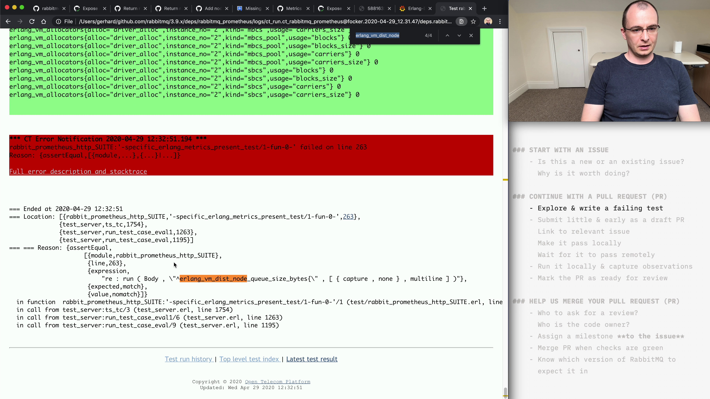

# TGIR S01E04: How to contribute to RabbitMQ? Part 2

* Proposed via [rabbitmq/tgir#4](https://github.com/rabbitmq/tgir/issues/4)
* Hosted by [@gerhardlazu](https://twitter.com/gerhardlazu)
* Published on: 2020-04-27

This is the second part of a multi-part series on how to contribute to RabbitMQ.
Our contribution will be to submit a pull-request across multiple repositories and see it released in the next RabbitMQ patch release.

To get the best out of this episode, I encourage you to follow along and, ideally, submit a pull request to RabbitMQ.
All commands are available as make targets in this episode's directory.

## Timeline

- [00:00:00](https://www.youtube.com/watch?v=TGIRS01E04&t=0s) - Today's topic

## Links

## Make targets

## Notes

### START WITH AN ISSUE
- New or existing?
- Why is it worth doing?

### CONTINUE WITH A PULL REQUEST (PR)
- Explore first
- Write a failing test - integration tests are not a scam
- Make it pass locally
- Submit little & early as WIP
- Ensure checks stay green
- Why is the discussion the most valuable aspect?
- Keep history clean by rebasing
- Link to a dependent PR, in a dependency
- Change the PR state to done

### A RABBITMQ TEAM MEMBER WILL HELP
- Who to ask for feedback?
- How to review?
- Assign a milestone to the issue
- Merge & wait for dev build
- Where to find automated dev builds?
- Where to find the automated release summary?
- How to update release notes

### TEST YOUR CHANGE IN A PRE-RELEASE
- How to download a pre-release?
- How to use a pre-release in the official RabbitMQ Docker image?
- Provide pre-release feedback on the PR

### IN THE NEXT EPISODE...
- Preview docs & share improvements
- One-command RabbitMQ dev env
