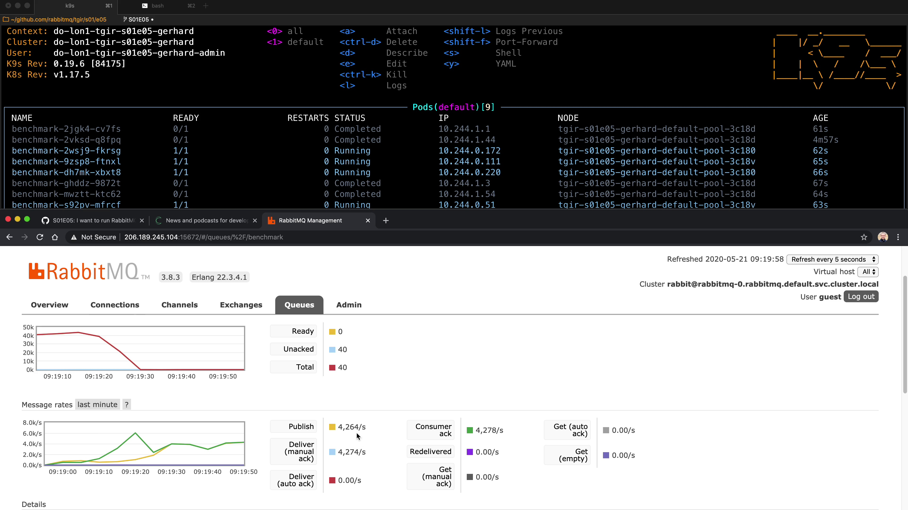

# TGIR S01E05: I want to run RabbitMQ on K8S - Where do I start?

* Proposed via [rabbitmq/tgir#11](https://github.com/rabbitmq/tgir/issues/11)
* Hosted by [@gerhardlazu](https://twitter.com/gerhardlazu)
* Published on: 2020-05-29
* Video: https://www.youtube.com/watch?v=-yU95ocpBYs

<a href="https://www.youtube.com/watch?v=-yU95ocpBYs" target="_blank"></a>

You want to run RabbitMQ on Kubernetes (K8S) and would like to know where to start.

This video will show you how to:
1. Setup a K8S cluster with one command and deploy RabbitMQ a few minutes later
2. Keep persistent data safe
3. Expose RabbitMQ HTTP & AMQP via public IP
4. Benchmark it


## MAKE TARGETS

```
all                         Create K8S cluster, deploy RabbitMQ, make public & persistent, then benchmark
benchmark                   Benchmark simplest RabbitMQ on K8S
clean                       Delete RabbitMQ and all linked resources, then delete K8S cluster
env                         Configure shell env - eval "$(make env)"
k8s                         Create K8S cluster
k8s-ls                      List K8S clusters
k8s-node-sizes              Show all size options for K8S nodes
k8s-regions                 Show all regions where K8S can be deployed
k8s-rm                      Delete K8S cluster
k9s                         Interact with K8S via terminal UI
lbs                         Show all Load Balancers
persistent                  Give RabbitMQ on K8S persistent storage
public                      Make simplest RabbitMQ on K8S public
rabbitmq                    Deploy the simplest RabbitMQ on K8S
rabbitmq-rm                 Delete RabbitMQ and all linked resources
resources                   Show all resources
shell                       Open shell in RabbitMQ node
vms                         Show all VMs (aka Droplets)
vols                        Show all Volumes
```
