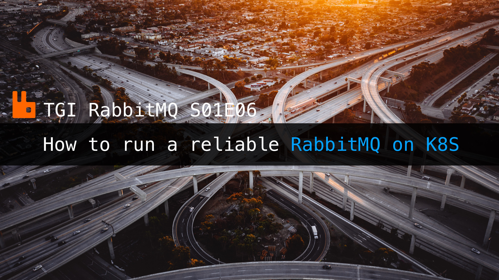

# TGIR S01E06: How to run a RabbitMQ cluster reliably on K8S?

* Proposed via [rabbitmq/tgir#13](https://github.com/rabbitmq/tgir/issues/13)
* Hosted by [@gerhardlazu](https://twitter.com/gerhardlazu)
* Published on: 2020-09-30

<a href="https://www.youtube.com/watch?v=TGIRS01E06" target="_blank"></a>

You have a single RabbitMQ node running on Kubernetes (K8S).
[S01E05](https://github.com/rabbitmq/tgir/tree/S01E05/s01/e05) covered the getting started part well, and [Deploying RabbitMQ to Kubernetes: What’s Involved?](https://www.rabbitmq.com/blog/2020/08/10/deploying-rabbitmq-to-kubernetes-whats-involved/) blog post added more detail.

With the RabbitMQ on K8S basics understood, it's time to deploy a RabbitMQ cluster and tackle more advanced topics:

1. What are good liveness & readiness probes?
2. How to configure RabbitMQ for availability during RabbitMQ upgrades?
3. How to configure RabbitMQ for availability during K8S upgrades?
4. How to configure clients for handling a minority of RabbitMQ nodes becoming unavailable?
5. What to expect when a majority of RabbitMQ nodes go away?
6. What happens when all RabbitMQ nodes go away?


## MAKE TARGETS

`
all                         Create K8S cluster & deploy RabbitMQ
clean                       Delete the RabbitMQ cluster and all associated resources, then delete the K8S cluster on GKE that we have deployed
disks                       List all disks
env                         Configure shell env - eval "$(make env)" OR source .env
instances                   List all instances
k8s                         Create a managed K8S cluster on GCP (GKE) - up to 4 minutes
k8s-help                    List all options available when creating a managed K8S cluster on GCP (GKE)
k8s-ls                      List all GKE clusters running on GCP
k8s-rm                      Delete our GKE cluster
k8s-upgrade                 Upgrade node pool to control plane version - up to 10 minutes
k8s-versions                List all available K8S versions on GCP (GKE)
k9s                         Interact with our K8S cluster via a terminal UI
rabbitmq                    Deploy a reliable RabbitMQ cluster on GKE
rabbitmq-clients            Deploy reliable RabbitMQ clients on our K8S cluster running in GCP
rabbitmq-clients-rm         Delete all RabbitMQ clients
rabbitmq-management         Open RabbitMQ Management in a browser
rabbitmq-rm                 Delete the RabbitMQ cluster and all associated resources that we have deployed
rabbitmq-upgrade            Upgrade RabbitMQ
simulate-loss-of-all        Simulate losing all instances across all 3 zones
simulate-loss-of-majority   Simulate losing all instances in 2 zones (majority)
simulate-loss-of-minority   Simulate losing all instances in 1 zone (minority)
watch-instances             Watch all instances
watch-nodes                 Watch all K8S nodes``
```
