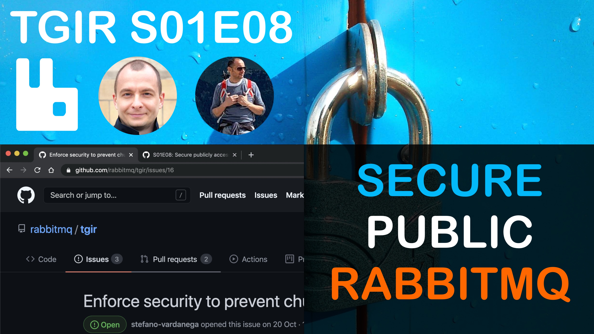

# TGIR S01E08: Securing publicly accessible RabbitMQ clusters

* Proposed via [rabbitmq/tgir#16](https://github.com/rabbitmq/tgir/issues/16)
* Hosted by [@gerhardlazu](https://twitter.com/gerhardlazu) & [@GSantomaggio](https://twitter.com/GSantomaggio)
* Published on: 2020-11-27

## LINKS

## MAKE TARGETS
