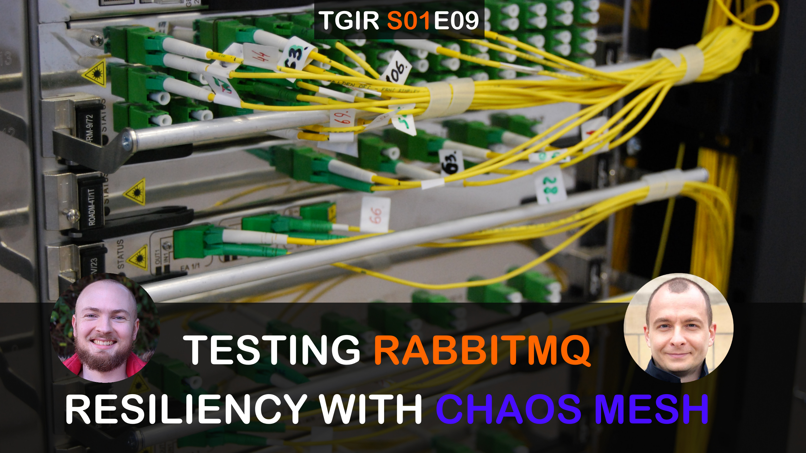

# TGIR S01E09: Testing RabbitMQ Resiliency with Chaos Mesh

* Proposed via [rabbitmq/tgir#19](https://github.com/rabbitmq/tgir/issues/19)
* Hosted by [@corodotdev](https://twitter.com/corodotdev) & [@gerhardlazu](https://twitter.com/gerhardlazu)
* Published on: 2020-12-n

<a href="https://www.youtube.com/watch?v=y2HAJBiXsw0" target="_blank"></a>

How does RabbitMQ handle network latency? What about a clean network partition? And a partial network partition, or [partial switch failures](https://blog.cloudflare.com/a-byzantine-failure-in-the-real-world/)?

We have at our disposal a wide variety of tooling for the Kubernetes infrastructure that will let us make new discoveries about the behaviour of RabbitMQ. In this episode, we'll give you all the tools to set you up to make these discoveries yourself, and show you some of the interesting behaviours we've found so far.

## LINKS
* [Chaos Mesh](https://chaos-mesh.org/) - Chaos testing framework for Kubernetes clusters by the CNCF
* [RabbitMQ Cluster Kubernetes Operator](https://github.com/rabbitmq/cluster-operator) - to easily spin up RabbitMQ Clusters in Kubernetes
* [TGIR S01E09](https://www.youtube.com/watch?v=NWISW6AwpOE) - Setting up the monitoring framework used in this episode
* [Cloudflare blog about their partial network partitions](https://blog.cloudflare.com/a-byzantine-failure-in-the-real-world/)


## MAKE TARGETS

```
all                                Create the cluster & stacks needed for the episode in GKE - Chaos Mesh, Grafana, Prometheus & RabbitMQ Operator
base                               Create the cluster & all stacks needed for the episode in GKE, except for Chaos Mesh
chaos-az-latency                   Introduce 1s of latency to&from a random pod in the cluster
chaos-az-partition                 Create a network partition seperating one RabbitMQ node completely from the other two
chaos-cpu-stealing                 Cause CPU pressure in a random RabbitMQ pod, simulating CPU stealing
chaos-intra-node-partition         Create a network partition only between two of the nodes, leaving other connections intact
chaos-memory-filling               Cause memory pressure in a random RabbitMQ pod, reducing available memory for RabbitMQ
chaos-operator                     Install Chaos Mesh Operator
chaos-slow-disk                    Add latency to file I/O operations to simulate a slow disk on a random RabbitMQ pod
clear-chaos                        Clear any Chaos Mesh events from the cluster
disks                              List all disks
env                                Configure shell env - eval "$(make env)" OR source .env
instances                          List all instances
k8s                                Create a managed K8S cluster on GCP (GKE) - up to 4 minutes
k8s-help                           List all options available when creating a managed K8S cluster on GCP (GKE)
k8s-ls                             List all GKE clusters running on GCP
k8s-rm                             Delete our GKE cluster
k8s-versions                       List all available K8S versions on GCP (GKE)
k9s                                Interact with our K8S cluster via a terminal UI
monitoring-stack                   Integrate Prometheus & Grafana with K8S, including system metrics
quorum-clients                     Create RabbitMQ clients to start 1000 quorum queues
rabbitmq-observer                  Exec into RabbitMQ Pod to launch the RabbitMQ diagnostics observer
rabbitmq-operator                  Install RabbitMQ Cluster Operator into K8S
rabbitmq-pause-minority-cluster    Install the production-ready RabbitMQ cluster with pause_minority partition handling
rabbitmq-production-cluster        Install the production-ready RabbitMQ cluster
rebalance-queues                   Exec into RabbitMQ Pod to rebalance queue leaders across cluster
teardown-chaos-operator            Remove Chaos Mesh Operator
teardown-monitoring-stack          Teardown the whole monitoring stack
teardown-pause-minority-cluster    Teardown the pause_minority production-ready RabbitMQ cluster
teardown-production-cluster        Teardown the production-ready RabbitMQ cluster
teardown-quorum-clients            Delete quorum queue RabbitMQ clients
teardown-rabbitmq-operator         Teardown the RabbitMQ Cluster Operator
watch-instances                    Watch all instances
watch-nodes                        Watch all K8S nodes
```
